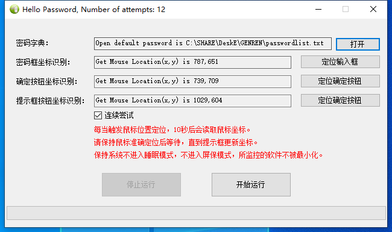

# 暴力密码破解器

密码忘记，想不起来？咱们来个最老土的笨方法，循环暴力破解，根据提供的常用密码库进行挨个尝试，只要你有足够时间，咱们就挨个试。\(^o^)/~

老话题，事出有因，大致是这样的，有一次一台工业设备PLC程序锁住了，机主忘记了密码在网上寻求帮助，其反馈知道密码的位数和大致规则，就需要挨个尝试。

他在努力的回想并认真地敲击键盘录入可能的密码，不断的尝试。

得知后，爱偷懒的我，就有种想要拯救他的睡眠，于是乎本项目所涉及的一端程序就诞生了。

大致步骤是，根据规则生成一个可能密码字典TXT文件，模仿鼠标点击、键盘录入、按钮确定、图像识别等。

对密码字典逐一自动录入尝试，解放双手，直到密码验证成功，给出提示。

这样一来，此老哥就可以安心睡觉了，早上就能看到结果了。

记录一下可能会对你有所帮助，并且非常欢迎大家贡献它~

## 如何贡献

针对发现的问题，直接修改并提交 Pull request 即可。

## 启动它

